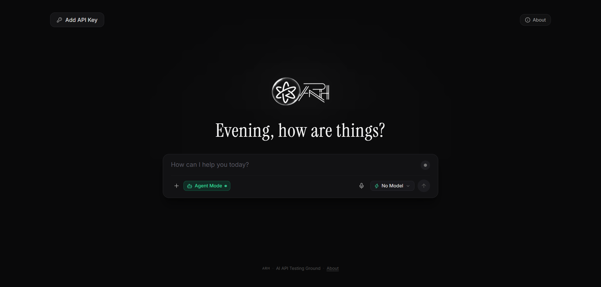

<div align="center">

# ⚡ ARH — AI API Testing Ground & Agent Sandbox

**A minimalist, universal, stateless playground and autonomous execution environment to test, validate, and chat with 22+ AI providers instantly.**

[](https://github.com/aruchith08/api-key-tester-chatbot)
[](https://www.typescriptlang.org/)
[](https://react.dev/)
[](https://vitejs.dev/)
[](https://pyodide.org/)
[](https://vercel.com/)
[](https://github.com/aruchith08/api-key-tester-chatbot)

<br />
<br />



</div>

---

## 🌟 What is ARH?

**ARH (API Testing Ground & Agent Sandbox)** is a developer-first AI playground designed to test API keys across any major foundation model provider without setup friction, backend databases, or complex configurations. 

Paste an API key from **Groq, OpenAI, Anthropic, Gemini, NVIDIA NIM, DeepSeek, OpenRouter, Together, Fireworks, Perplexity, Cerebras, Token Router, BazaarLink, NRouter, Experiential Labs, Mistral, Cohere, xAI, Hugging Face, or Ollama** — ARH instantly detects the provider, validates credentials, discovers live models, and launches a real-time streaming chat session with autonomous code execution and file previews.

---

## 🚀 Key Capabilities & Features

### 1. 🔍 Instant Key Pattern Detection
- Heuristic regex engine identifies distinct key signatures in real-time as you type or paste (`xpl_` for Experiential Labs, `gsk_` for Groq, `nvapi-` for NVIDIA NIM, `AIzaSy` for Google Gemini, `sk-ant-` for Anthropic, `sk-or-` for OpenRouter, `sk-proj-` for OpenAI, etc.).
- Categorizes confidence levels (`high`, `medium`, `low`) with transparent rationale and multi-candidate manual selection for ambiguous keys.

### 2. 🤖 Autonomous Agent Mode (In-Flight Tool Calling Loop)
- **True Agentic Harness**: Models that support function/tool calling (OpenAI GPT-4o, Groq LLaMA 3.3/3.1, Claude 3.5, Gemini 1.5/2.0) are equipped with the `execute_python` tool.
- **ReAct Execution Loop**: The model emits a tool call, the app pauses generation, executes the script in the client-side Pyodide sandbox, extracts any generated files, feeds the results (`stdout`, `stderr`, file list) back into the conversation context with `{ role: 'tool' }`, and prompts the model to verify its output before writing the final response.
- **Fail-Safe Fallback**: If a provider or custom endpoint does not support tool schemas, ARH automatically falls back to direct chat mode with post-generation detection.

### 3. 🐍 Client-Side WebAssembly Python Sandbox (Pyodide)
- Runs Python 3 inside an isolated browser Web Worker powered by WebAssembly (Wasm) and an in-memory virtual filesystem (MEMFS).
- **Preloaded Document & Data Libraries**: Supports `python-docx` (`docx`), `openpyxl`, `pandas`, `matplotlib`, `reportlab`, `pydantic`, and `sympy`.
- **Autonomous File Extraction**: When scripts call `doc.save('report.docx')`, `wb.save('data.xlsx')`, `plt.savefig('chart.png')`, or `open('data.csv', 'w')`, generated binary files are automatically extracted into browser Blob URLs with download cards.
- **Manual Execution**: Every code block features an interactive "Run in Sandbox" button with live status pills and logs drawers.

### 4. 📂 Right-Side In-Browser File Preview Drawer ("Sider")
- Slide-over drawer on the right side of the screen for instant, zero-software previewing of chat artifacts:
  - 📄 **PDFs (`.pdf`)**: Native embedded browser PDF reader with zoom, search, and page navigation.
  - 📝 **Word Documents (`.docx`, `.doc`)**: Lazy-loaded Mammoth.js engine rendering styled paper document layouts with headings, styled tables, lists, and images.
  - 📊 **Excel Spreadsheets (`.xlsx`, `.xls`, `.csv`, `.tsv`)**: Lazy-loaded SheetJS workbook parser with **multi-sheet tabs** (`Sheet1`, `Sheet2`), sticky column headers (A, B, C...), row indices, search/cell filtering, and gridlines.
  - 🌐 **HTML (`.html`, `.htm`)**: Dual-view toggle between sandboxed visual iframe preview and syntax-highlighted source code.
  - 🖼️ **Images (`.png`, `.jpg`, `.jpeg`, `.svg`, `.webp`, `.gif`)**: Interactive canvas with Zoom In (+), Zoom Out (-), Reset (100%), and transparency checkerboard.
  - 💻 **Code & Text (`.txt`, `.md`, `.json`, `.py`, `.sql`)**: Syntax-highlighted text reader with line numbers and 1-click copy.
  - **Fullscreen Toggle**: Expand the preview drawer across the full viewport with one click.

### 5. 🧠 Reasoning & Thinking Model Support
- Separate visual thinking drawers for reasoning models (DeepSeek-R1, Cerebras, Nemotron, OpenAI o1/o3-mini).
- Automatically parses `<think>` XML blocks or separate SSE reasoning streams (`delta.reasoning_content`) with collapsible accordion display and duration metrics.

### 6. 🎙️ Voice Input (Speech-to-Text)
- Integrated Web Speech API microphone input with real-time audio pulsing indicators and automatic punctuation.

### 7. 🛡️ Zero-Persistence Ephemeral Security
- **No databases. No localStorage. No telemetry. No server logs.**
- Your API key and conversation history live strictly in runtime memory.
- Closing or refreshing the tab completely wipes all credentials from existence.
- Automatic key masking (`sk-proj-...1a2b`) protects your screen from shoulder-surfing.

### 8. 🌐 Adaptive Connection Architecture
- **Direct Browser Transport**: For providers with open CORS (Groq, OpenRouter, Hugging Face, Together), requests stream directly from your browser to the provider’s endpoint.
- **Stateless Proxy Fallback**: For enterprise APIs that restrict browser CORS (NVIDIA NIM and OpenAI), ARH routes requests through a lightweight, stateless proxy (built into Vite for local dev and Vercel Edge Functions for production).

### 9. 🔍 Developer Mode & Inspector
- Dedicated **`>_ Dev Mode`** drawer.
- Inspect raw HTTP requests, sanitized headers (secrets masked), response bodies, status codes, and latency breakdowns for every call.

---

## 🧠 Supported Providers Matrix

ARH includes built-in adapters and model normalization for 22 industry providers:

| Provider | Key Signature | Connection Mode | Dynamic Models | Live Streaming | Tool Calling / Agent |
| :--- | :--- | :--- | :--- | :---: | :---: |
| **Groq** | `gsk_...` | Direct Browser | ✅ Yes | ✅ Yes | ✅ Yes |
| **Google Gemini** | `AIzaSy...` | Direct (Query Auth) | ✅ Yes | ✅ Yes | ✅ Yes |
| **Anthropic Claude** | `sk-ant-api03-...` | Direct (Caveat Header) | ✅ Yes | ✅ Yes | ✅ Yes |
| **OpenRouter** | `sk-or-v1-...` | Direct Browser | ✅ Yes | ✅ Yes | ✅ Yes |
| **NVIDIA Build (Free Endpoint)** | `nvapi-...` | Proxy Fallback (CORS) | ✅ Dynamic (`/v1/models`) | ✅ Yes | ✅ Yes |
| **OpenAI** | `sk-proj-...` / `sk-...` | Proxy Fallback (CORS) | ✅ Yes | ✅ Yes | ✅ Yes |
| **DeepSeek** | `sk-...` (32 hex) | Proxy Fallback (CORS) | ✅ Yes | ✅ Yes | ✅ Yes |
| **Together AI** | `64-hex key` | Direct Browser | ✅ Yes | ✅ Yes | ✅ Yes |
| **Fireworks AI** | `fw_...` | Direct Browser | ✅ Yes | ✅ Yes | ✅ Yes |
| **Cerebras** | `csk-...` | Direct Browser | ✅ Yes | ✅ Yes | ✅ Yes |
| **Token Router** | `vk_live_...` | Proxy Fallback (CORS) | ✅ Yes | ✅ Yes | ✅ Yes |
| **BazaarLink** | `sk-bl-...` | Direct Browser | ✅ Yes | ✅ Yes | ✅ Yes |
| **NRouter** | `sk-nrouter-...` | Proxy Fallback (CORS) | ✅ Yes | ✅ Yes | ✅ Yes |
| **Experiential Labs** | `xpl_...` (40 hex) | Direct / Proxy | ✅ Yes | ✅ Yes | ✅ Yes |
| **Perplexity AI** | `pplx-...` | Proxy Fallback (CORS) | ✅ Fallback | ✅ Yes | ✅ Fallback |
| **xAI (Grok)** | `xai-...` | Direct Browser | ✅ Yes | ✅ Yes | ✅ Yes |
| **Mistral AI** | `32-char key` | Direct Browser | ✅ Yes | ✅ Yes | ✅ Yes |
| **Cohere** | `40-char key` | Direct Browser | ✅ Yes | ✅ Yes | ✅ Yes |
| **Hugging Face** | `hf_...` | Direct Browser | ✅ Yes | ✅ Yes | ✅ Yes |
| **Moonshot (Kimi)** | `sk-...` | Proxy Fallback (CORS) | ✅ Yes | ✅ Yes | ✅ Yes |
| **Custom / Ollama** | `http://...` | Direct Localhost | ✅ Yes | ✅ Yes | ✅ Yes |

---

### 🟢 NVIDIA Build & Free Endpoint Models

ARH features full native integration with **NVIDIA Build** (`https://build.nvidia.com`), supporting its curated catalog of Free Endpoint models:

- **Base URL**: `https://integrate.api.nvidia.com/v1`
- **Dynamic Model Discovery**: `GET https://integrate.api.nvidia.com/v1/models` queries all available live models at runtime.
- **Chat Endpoint**: `POST https://integrate.api.nvidia.com/v1/chat/completions`
- **Authentication**: `Authorization: Bearer nvapi-...`
- **Authoritative Model IDs**: Model IDs are strictly preserved from the NVIDIA API response (e.g. `openai/gpt-oss-20b`, `meta/muse-glimmer-30b`, `meta/llama-3.2-90b-vision-instruct`, `nvidia/nemotron-3-super-120b-a12b`). Model IDs are never artificially prefixed with `nvidia/` or fabricated.
- **Model Capability Classification**: Models are categorized across `chat`, `vision`, `reasoning`, `embedding`, `audio`, `translation`, `safety`, `autonomous-driving`, and `optimization`.
- **Chat Filtered Selector**: The primary chat model selector exposes only chat-capable models, with category tabs (`Chat`, `Vision`, `Reasoning`, `Embeddings`, `Audio`, `Translation`, `Safety`, `All`) and live dynamic refresh.
- **Rate Limit & Error Handling**: Gracefully maps HTTP 401/403, 404 (with exact model ID), and 429 ("NVIDIA Free Endpoint rate limit reached. Please wait and try again.").

---

## 🏗️ Architecture & Network Flow

```text
                           ┌────────────────────────┐
                           │      User Browser      │
                           │       ARH Web UI       │
                           └───────────┬────────────┘
                                       │
                                Paste API Key
                                       │
                                       ▼
                       ┌────────────────────────────────┐
                       │    Provider Detection Engine   │
                       │ (Heuristics, RegEx, Rationale) │
                       └───────────────┬────────────────┘
                                       │
                                       ▼
                      ┌──────────────────────────────────┐
                      │   Connection Strategy Resolver   │
                      └────────┬───────────────────┬─────┘
                               │                   │
                     CORS Supported         CORS Restricted
                               │                   │
                               ▼                   ▼
                     ┌──────────────────┐  ┌──────────────────┐
                     │ Direct Transport │  │  Stateless Proxy │
                     │  (Browser Fetch) │  │ (Vite / Vercel)  │
                     └────────┬─────────┘  └────────┬─────────┘
                              │                     │
                              ▼                     ▼
                     ┌──────────────────────────────────┐
                     │         AI Provider API          │
                     │  (Groq, OpenAI, Anthropic, NIM)  │
                     └─────────────────┬────────────────┘
                                       │
                           Tool Call / Code Emitted
                                       │
                                       ▼
                     ┌──────────────────────────────────┐
                     │Pyodide WebAssembly Sandbox (Wasm)│
                     │ (MEMFS, docx, openpyxl, pandas)  │
                     └─────────────────┬────────────────┘
                                       │
                           Extracted Artifacts & Logs
                                       │
                                       ▼
                     ┌──────────────────────────────────┐
                     │ Right-Side Preview Drawer Sider  │
                     │ (PDF, Word, Excel, HTML, Images) │
                     └──────────────────────────────────┘
```

---

## 🛠️ Local Development

### Prerequisites
- Node.js 18+ (Node 20+ recommended)
- npm, pnpm, or yarn

### Installation

```bash
# 1. Clone the repository
git clone https://github.com/aruchith08/api-key-tester-chatbot.git
cd api-key-tester-chatbot

# 2. Install dependencies
npm install

# 3. Start development server
npm run dev
```

Visit **`http://localhost:5173`** in your browser.

---

## 🧪 Automated Testing

ARH includes an automated test suite comprising **186 unit, adapter, heuristic, sandbox, and normalization tests**:

```bash
# Run all automated test suites
npm test
```

### Test Coverage Summary:
- **Provider Detection Heuristics**: 20 tests verifying prefixes, hex lengths, and edge cases.
- **Provider Synchronization**: 8 regression tests verifying zero race conditions on input switching.
- **OpenAI-Compatible Adapter**: 14 tests for payload formatting, endpoint resolution, and normalization.
- **Google Gemini Adapter**: 11 tests covering system instruction, multipart image payload, and role mapping.
- **Anthropic Claude Adapter**: 9 tests verifying header compliance and message structure.
- **Error Normalization**: 14 tests checking status codes (401, 403, 429, 500, network blocks).
- **Streaming SSE Parsing**: 24 tests covering token deltas, usage metadata, reasoning chunks, and think tags.
- **Transport & Strategy**: 21 tests validating connection mode determination and truth layers.
- **Python Code Detection & Heuristics**: 15 tests verifying file-saving patterns across libraries.
- **Autonomous Agent Tools & ReAct Harness**: 26 tests verifying tool schemas, argument parsers, multi-turn tool message formatting, streaming tool call aggregation, and preview drawer state management.
- **Live Integration Testing**: Conditional test harnesses for environment variables.

---

## ☁️ Deploying to Vercel

ARH is pre-configured for **one-click deployment to Vercel**:

### Option 1: Vercel CLI

```bash
npm install -g vercel
vercel
```

### Option 2: GitHub Integration

1. Push this repository to GitHub.
2. Go to [Vercel Dashboard](https://vercel.com/new) and select **Import Git Repository**.
3. Vercel automatically detects the Vite configuration:
   - **Framework Preset**: `Vite`
   - **Build Command**: `npm run build`
   - **Output Directory**: `dist`
4. Click **Deploy**.

> **Note**: ARH includes `api/proxy.ts` running on the **Vercel Edge Runtime**, allowing CORS-restricted APIs (like NVIDIA NIM and OpenAI) to function seamlessly in production without requiring third-party proxies.

---

## 🔒 Security & Privacy Statement

- **Client-Side First**: Your API keys are kept entirely within your local browser memory.
- **Zero Backend Storage**: ARH does not have a database, user tracking, or third-party analytical cookies.
- **Ephemeral Sessions**: Refreshing the browser or clearing the state destroys all active credentials and chat contents.
- **Open Source**: All network requests and adapters are transparent and open for inspection in [`src/providers`](./src/providers) and [`src/sandbox`](./src/sandbox).

---

## 📄 License

MIT License. Feel free to use, modify, and distribute for private or commercial testing.
